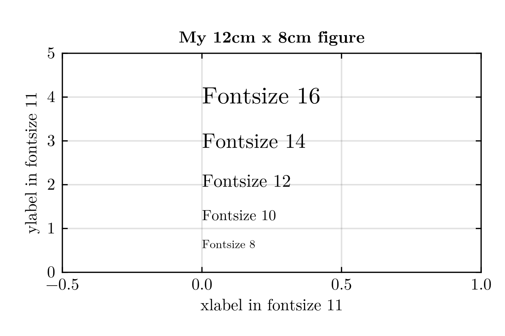

# MakiePublicationTheme

[](https://kimauth.github.io/MakiePublicationTheme.jl/stable/)
[](https://github.com/kimauth/MakiePublicationTheme.jl/actions/workflows/CI.yml?query=branch%3Amain)

My favourite settings for publication quality [`Makie.jl`](https://docs.makie.org/) plots.
This theme is for example used in [Auth et. al., 2024](https://doi.org/10.1016/j.euromechsol.2024.105418).


The [Makie demofigure for themes](https://docs.makie.org/stable/explanations/theming/predefined_themes) will look as follows:
```julia
using MakiePublicationTheme
using CairoMakie, Random # needed for demofigure

with_theme(publication_theme()) do
    f = demofigure()
end
```


# Exporting figures with physical dimensions
`MakiePublicationTheme.jl` supplies helper functions in order to [match physical figure and
font sizes](https://docs.makie.org/v0.21/explanations/figure#Matching-figure-and-font-sizes-to-documents)
when saving figures.
```julia
using MakiePublicationTheme
using CairoMakie, Random

set_theme!(publication_theme())
update_theme!(fontsize=11) # use fontsize 11 instead of the default fontsize 10 here

size_cm = (12.0, 8.0)
dpi = 300
size, px_per_unit = size_pixelgraphic(size_cm, dpi)

# generate figure with correct canvas size
f = Figure(; size)

# fill the figure with a few things with font sizes
ax = Axis(f[1,1];
    xlabel = "xlabel in fontsize 11",
    ylabel = "ylabel in fontsize 11",
    title = "My 12cm x 8cm figure",
    xticks = MultiplesTicks(5, π, "π"),
    )
lines!(ax, 0.0:0.1:3π, sin)
lines!(ax, 0.0:0.1:3π, cos)
cycle = (color=:color) # cycle over (lineplot) colors instead of inheriting :textcolor
text!(ax, 3π/4, sin(3π/4); text="sin", align=(:left, :bottom), cycle, fontsize=16)
text!(ax, 3π/4, cos(3π/4); text="cos", align=(:right, :top), cycle, fontsize=16)

# save figure that will have a resolution of 300dpi at 12cm x 8cm size
save("my_12x8cm_figure.png", f; px_per_unit)
```

